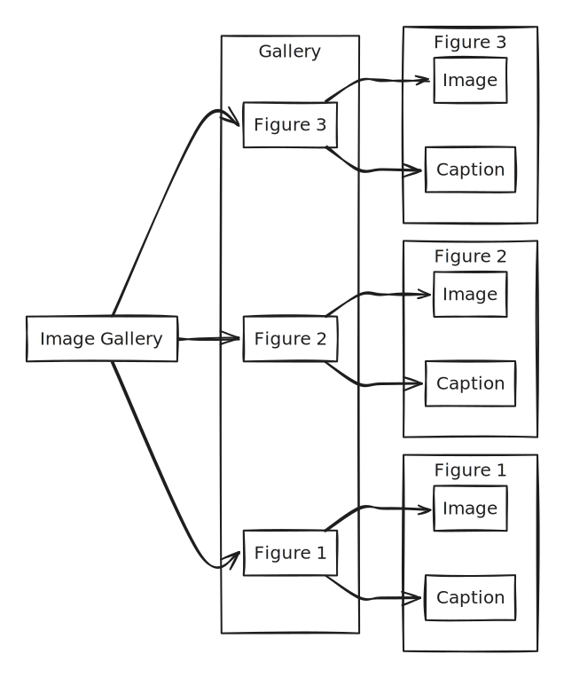

# 👋 Page 1

Link [#page-heading](page-2.md#page-heading "mention") 565433

dsfsdf

dfssd

_This_ is a paragraph :thumbsup: with an emoji.

$$
112=12345
$$



$$
f(x) = x * e^{2 pi i \xi x}
$$

`A complex list:`

ist it

* Test 1
* Test 2
*

<div>

<figure><figcaption></figcaption></figure>

 

<figure><figcaption></figcaption></figure>

 

<figure><figcaption></figcaption></figure>

</div>

* List item 2
  - ***
  - List item 2a
  - List item 2b
    * List item 2ba
    * List item 2bc
    * List item 2bd
      * List item 2bda
      * List item 2bdb
  - List item 2c
* List item 1
  * List item 1a
* List item 3
* List item 4
* List item 5

<div>

<figure><figcaption></figcaption></figure>

 

<figure><figcaption></figcaption></figure>

</div>


An image:

<div>

<figure><figcaption></figcaption></figure>

 

<figure><figcaption></figcaption></figure>

</div>

An expandable block:

<details>

<summary>Testing expandable</summary>

It comes down to what you're looking to get out of the experience. For example, you may engage in the community as a delegate. In such case, it would behoove you to acquire as much TORQ as possible in order to gain sufficient voting power.

Maybe you want to access liquidity to go long on a new token coming out. You can deposit a blue-chip like WBTC or WETH and receive a loan up to 83% of the value (while earning TORQ). You can use this to trade and repay as preferred.

_This is not financial advice._

If you're simply interested in extracting as much profit as possible, consider depositing collateral for a loan through our Borrow product then head to Boost and deposit your received loan. In this case, you will earn TORQ rewards from Borrow and Boost while your deposit is earning the spread between interest rates.

If you choose not to repay, eventually, interest accrued will increase your loan-to-value (LTV) ratio pushing it into liquidatable range. In such case, a sliver of your collateral asset may be liquidated to ensure the health of your position.

```
And code here
```

</details>

### Heading


DO somethi SSng




Tab 1 content

> Woo hoo SDS



Tab 2 conten St



> This is a quote from someone

A todo list:

pandable block:

<details>

<summary>Testing expandable</summary>

Some content in the expandable

```
And code here
```

</details>

### Heading


DO somethi SSng




Tab 1 content

> Woo hoo SDS



Tab 2 conten St



> This is a quote from someone

* [ ] Todo 1
* [ ] To do 2
  * [ ] Sub\
    Todo 3
    * [ ] Sub Todo again\\



<table><thead><tr><th>Table</th><th>aas</th><th data-type="content-ref">xcvx</th></tr></thead><tbody><tr><td>a</td><td>vcvx</td><td><a href="https://app.gitbook-staging.com/o/M6BrxtuiVnqv5V3cgPu4/s/im5PiZkP0JmfF3k2LNeq/">New Test Space</a></td></tr><tr><td>aa</td><td>cxzd</td><td></td></tr><tr><td><br></td><td></td><td></td></tr><tr><td></td><td></td><td></td></tr></tbody></table>
