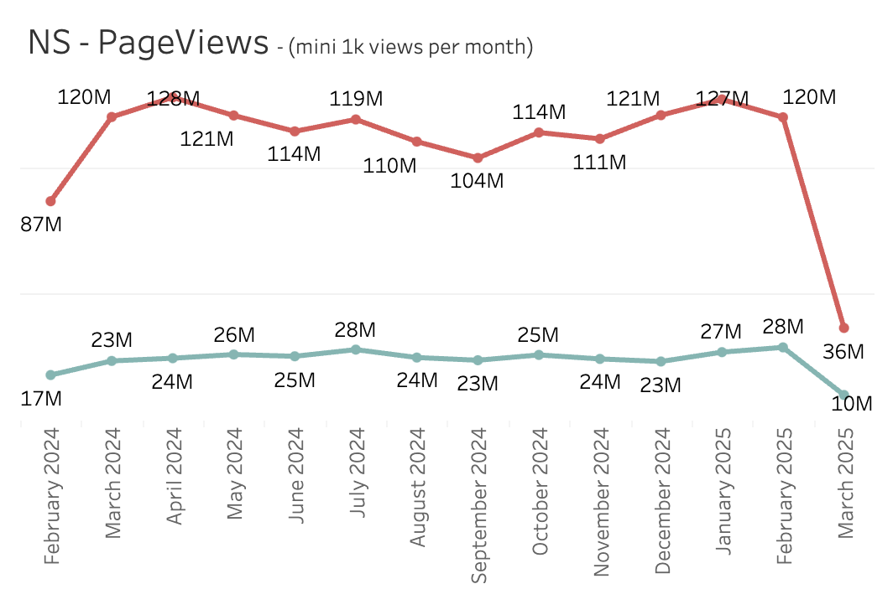
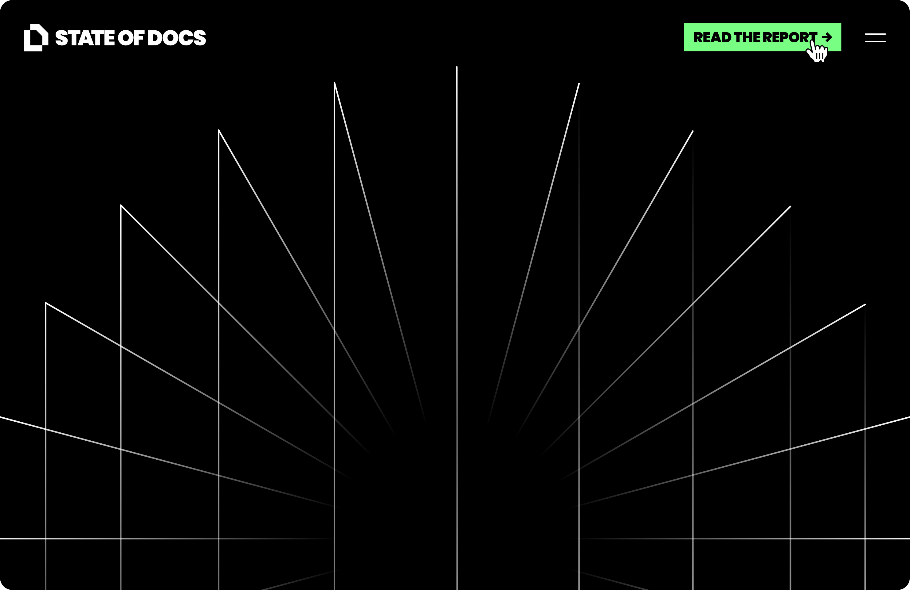

# Test normal virtualization

PageViews: 120M in Feb / 127M in January

**Why it's important:**&#x20;

* Public Traffic is a laggy indicator of success
* Our main source of UA

**Updates:**

* In line with January
* Good performance on powered by ICP traffic

ICP Sign-Up: 744 in Feb / 693 in January

**Why it's important:**&#x20;

* ICP are customers we can keep and grow:
  * 5% churn rate for None ICP vs 2% for ICP
  * $60 ARPA for None ICP vs $150 for ICP

**Updates:**

.png>)

Known Business MRR Retention: 102% - Reached sooner than the target 

Thanks to `Ultimate` site being sold to existing customers, our MRR Expansion reached 30k which is our best score ever.

We need to keep the same pace!

**Why it's important:**&#x20;

* We need legit company to grow revenue over time
* Othterwise, we only rely on new Business to keep growing

<figure><figcaption></figcaption></figure>

## Pricing

Lorem ipsum is a pseudo-Latin text used in web design, typography, layout, and printing in place of English to emphasize design elements over content.&#x20;

## 💻 <mark style="color:blue;">Product</mark>

<pre class="language-javascript"><code class="lang-javascript">function test() {
<strong>  console.log(“Test”);
</strong>}
</code></pre>

Ultimate site:  +20 Ultimates so far in March vs 38 as goal

**Customers evolution**

* 13 Ultimate from new biz
* 10 Ultimate from expansion

Test  test

_More to see on Ultimate and Premium sites evolution in the_ [_revenue dashboard_](https://eu-west-1a.online.tableau.com/#/site/gitbook/views/ProductFinance/Dynamic?:iid=1)

**Some examples:**

* [https://docs.adapta.org/adapta-one/adapta-one-english](https://docs.adapta.org/adapta-one/adapta-one-english)

**Evolution:**

Test  test

Lorem ipsum is a scrambled version of "De finibus bonorum et malorum," a 1st-century BC text by Cicero, with words altered, added, and removed to make it nonsensical and improper Latin. Lorem ipsum is a common placeholder text that allows designers to focus on visual presentation by providing a natural-looking block of text.

Test  test

***

* First 100 migration done ✅
  * Slightly less than 20% did the migration themselves, the rest was done by script
  * 1 churn so far (charge and complains could take time to come up)
  * 27% MRR increase (from 16k to 21k)
  * We are gonna work on a bigger batch (around 1.5k)

* Side work:
  * Allowing billing cycle update soon (in review)
* Site wizard v2:
  * after 1 week of collecting data, we wanna do some small tweaks as describe [here](https://gitbook.slack.com/archives/C069S5VGUTG/p1741621052358899)

<figure><figcaption>
In review
</figcaption></figure>

### Adaptive content

#### Completed

<figure><figcaption></figcaption></figure>

**Adapt search:** We've completed and released the changes to adapt search to support adaptive content.

#### **In progress**&#x20;

**UI tweaks & fixes:** We are making changes to the UI to polish the UI before we start releasing to selected customers.

**Docs:** We are going to make changes to the Adaptive Content docs to add more details on the feature and step-by-step guides on how customers can set things up on their end to pass claims for their visitors.

#### **Next**

We are going to start releasing Adaptive content to selected customers this week.

<figure><figcaption></figcaption></figure>

### Editor&#x20;

We clarified the goal and how we're going to track impact of the editor project to maintain momentum.

* **Goal :** Address users feedback that the editor is painful to use, unpredictable and slow.
* **North star metric :** Reduce the amount of support requests received about the editor.
  * We get a steady average of 80 requests per month, which over the past 6 months makes the editor the 2nd worse part of our product.
  * Those requests are turned into issues in linear, we have 42 [editor-issues in the backlog](https://linear.app/gitbook-x/team/RND/view/editor-1b8a61f0e084) atm. We'll work on getting that amount down.
* **Timeline :** We give us 1 month for now and evaluate progress every week to make sure we're consistently working on the most important issues.

:rocket: **Several noticeable fixes and improvements got shipping those past 2 weeks**

From [Broken link](broken-reference "mention")

* Tapping with trackpad on a heading block is fixed.
* Anchor section UX is fixed.
* ToC has more readable styles.
* ToC toggle button on small screens is back from the dead.
* Links normalization is fixed (new lines encoded char are now preserved).
* Page icon wasn't showing on small screen when title was long, it's fixed.

From [Broken link](broken-reference "mention")

* AI in Expandable block is here
* The triple-click to select is fixed! :star:

From [Broken link](broken-reference "mention")

New table rolled out to 100% as of today 🎉

* [#17034](https://github.com/GitbookIO/gitbook-x/pull/17034) - Reordering is more forgiving on your cursor’s position while dragging
* [#17002](https://github.com/GitbookIO/gitbook-x/pull/17002) - Improved design and UX of row controls (floating, sticky, and no arbitrary widths in first col)

What's next for the Table:

* [ ] Major remaining poor experience in tables is the keyboard/focus/selection management
* [ ] Better empty states for Select, Avatar, Users, Files, and Link (content-refs)

Some bug fixes 🐛

* Improved copy-paste behaviour of blocks
  * [#17015](https://github.com/GitbookIO/gitbook-x/pull/17015) - fixed a bug where some tables wouldn’t copy when they contained content-ref columns with empty cells
  * \#17026 - copying blocks outside of GitBook would show UI element's labels like “Comment”
* Ensuring all major table-issues in the backlog are fixed in the new one
* [#16970](https://github.com/GitbookIO/gitbook-x/pull/16970) - Rows further down large tables wouldnt show cause of (missing) virtualization
* [#16917](https://github.com/GitbookIO/gitbook-x/pull/16917) - Fixed triple-click not working as expected on (un)ordered and checkbox lists
* dgdf

### MariaDB Integrations

* Demo (Steven)

***

## 📢 <mark style="color:blue;">Marketing</mark>

#### State of Docs report

* Some partners have now shared the survey with their audiences, although we’re hoping more will soon.&#x20;
* The number of responses is lower than we’d like — we’re sending another email and in-app to our full database this week to encourage more responses.
* Tal and Addison have been reaching out to partners this week to get interviews/quotes for the report
* Early results are very interesting. Steve is working on a draft of the talking points (quick screenshare)
* Branding - currently on hold whilst I focus on website updates. Latest concepts can be found [here](https://www.figma.com/design/qKNFpiJSh3dfc3kX6g6ivO/State-of-Docs?node-id=162-160\&t=hZngCKJRoYtasBc6-1)
* Website - the survey landing page is live at [stateofdocs.com](https://www.stateofdocs.com/). Currently it links to the survey on GoogleForms

<figure><figcaption>
Landing page mockup
</figcaption></figure>

#### Content

* This week’s [changelog update](https://app.gitbook.com/o/d8f63b60-89ae-11e7-8574-5927d48c4877/s/PGZZo1PCN4rYgFLPD8Cl/~/changes/113/march-2025/11-march-new-and-improved-tables-plus-small-improvements-and-fixes#fixed) is on pause as it’s been a quiet week for big features. If I’ve missed anything, please post in the #changelog channel, but otherwise we’ll hold until next week
* We have a newsletter almost ready to send, but will hold off until next week to avoid spamming users.
* I’m working on a new guide on site structure, plus we have a couple more guides nearly finished by freelancers. Should hopefully start going live late this week/early next week.

**Website**

<figure><figcaption>
API docs landing page
</figcaption></figure>

* Working on a design for a new API landing page. The layout of this page will be used as a template for the other solutions landing pages. It’ll also bring the styling in-line with the updated Homepage and Pricing page.

<figure><figcaption>
Updated pricing cards
</figcaption></figure>

* The [pricing page](https://www.gitbook.com/pricing) has been updated:
  * Enterprise card added
  * Card designs have been refined (removed icons and general tidy up)
  * Link to the calculator added to Premium and Ultimate cards
  * Calculator moved up the page (inc. link back to the cards)

## <mark style="color:blue;">💸 Sales</mark>

* Wrapped up Q1 renewals - 88% retention (2 unmanaged churns, Snyk contraction)
* Nvidia signed
* Focused on onboarding Louis to the team last week
* He's learning quickly and is already leading calls


**Interesting case from last week**\
\
**-** Taran spotted that Algolia was trialing Mintlify on GitHub\
\- We made a demo site for them and reached out: [https://algolia-docs.gitbook.io/docs](https://algolia-docs.gitbook.io/docs)\
\- They responded saying they've already signed with mintlify mainly due to some custom migration work:\
\
"Hi Louis

Thanks for reaching out. However, we have committed to a year with Mintlify so won't be looking elsewhere for at least that long,

A few things tipped us in the Mintlify direction: white glove migration on our complex sources (not just Open API and Markdown but several iterations of bespoke YAML structured content), its similarity to our existing content provision environment, and their willingness to reinstate Algolia as their search tool.

Early days in the migration yet since we've asked them to pause and tackle the trickier stuff next.

If things go badly, rest assured we're big fans of GitBook and feel it occupies a similar space in the market to Mintlify. I've been impressed with what's been going on with GitBook lately.

Regards"\
\
**Learnings:** \
\
**1. We need to be there first**\
**2. Migration and custom solutions are important for these big accounts**


Test 

***

## <mark style="color:blue;">🛟 Support</mark>

* FRT 2h 55m
* Time to close 5h 19m
* CSAT: 83.3%

## <mark style="color:blue;">🎲 Other challenges, questions, ideas</mark>

***

## <mark style="color:blue;">🏢 Company</mark>

### 📢 Updates & announcements

### Hiring

Current Pipelines

<figure><figcaption></figcaption></figure>

Mostly focusing on sourcing!&#x20;

**Open Roles**

* [Product Engineer ](https://jobs.ashbyhq.com/GitBook/18363361-516d-4324-b9a1-203aaf8cf3bd)
* [Sales Development](https://jobs.ashbyhq.com/GitBook/9b2701c7-83db-4429-9ffc-311d3d0ddb12)
* [Solutions Engineer](https://jobs.ashbyhq.com/GitBook/1c9ef278-0763-482d-85d0-4eaf4effb316)

### Referrals

Last week we shared our updated referral program. You can check out the specifics in [slack ](https://gitbook.slack.com/archives/C032HV6MZ/p1741167957221029)or our [handbook](broken-reference)


7k€ gross bonus for every hired referrals - to be paid after 3 months within the role


### Offsite

* [Book your flights and add your info!](https://docs.google.com/spreadsheets/d/150DvYsPNYmafb9YvSGE-o9ygDY_paeUigsMB7fyx9_E/edit?gid=1497062478#gid=1497062478)
* Quick reminder:
  * Location: Lisbon
  * Hotel: [Locke de Santa Joana](https://www.lockeliving.com/en/lisbon/locke-de-santa-joana)  - GitBook will only cover for the event. If you wish to stay longer, plz book directly with hotel.
  * Dates: 2nd to 6th of June 2025
* Working on Agenda and activities!&#x20;

### Swag

1. Working on 2025 Swag packs&#x20;
2. [Complete Swag form](https://docs.google.com/forms/d/e/1FAIpQLScyaCe1S0bgsIcXnTqN75jaQfK_DR0tNLnl_JyRJWn7wGFEEg/viewform) for 2025 swag shipments
3. Some delays on new hires swag. Company we partner with are a bit slow, but we will get it delivered soon!

### :tada: Celebrations

<figure><figcaption>
HBD!
</figcaption></figure>

<figure><figcaption></figcaption></figure>

<figure><figcaption></figcaption></figure>

### :camera\_with\_flash: Life Lens

This week - Chris! :tada:

**Spin** the wheel - [https://wheelofnames.com/8cf-rth](https://wheelofnames.com/8cf-rth)

<table data-full-width="true"><thead><tr><th width="189.46484375"></th><th width="218.9375" data-type="checkbox"></th><th width="278.0234375"></th><th width="747.20703125"></th><th data-type="number"></th></tr></thead><tbody><tr><td>a</td><td>true</td><td></td><td></td><td>null</td></tr><tr><td></td><td>true</td><td>Test</td><td></td><td>null</td></tr><tr><td> sdf sdf sdf </td><td>true</td><td>Test sdf s</td><td></td><td>null</td></tr><tr><td></td><td>true</td><td></td><td></td><td>null</td></tr><tr><td>
This is a test
<ul><li><strong>Child</strong>: A node directly connected to another node when moving away from the  sdf root.</li></ul><ul><li><strong>Parent</strong>: The converse notion of a child.</li></ul><ul><li><strong>Subtree</strong>: Consists of a node and all its descendants.</li></ul></td><td>true</td><td>Twst sdf sdf asd sdsdfds </td><td> sdfds  sdf ds fsd sdf sasd sdf sdf</td><td>null</td></tr><tr><td></td><td>false</td><td></td><td></td><td>null</td></tr><tr><td></td><td>false</td><td></td><td></td><td>null</td></tr><tr><td></td><td>false</td><td></td><td></td><td>null</td></tr><tr><td></td><td>false</td><td></td><td></td><td>null</td></tr><tr><td></td><td>false</td><td></td><td></td><td>null</td></tr><tr><td></td><td>false</td><td></td><td></td><td>null</td></tr></tbody></table>


[Broken link](broken-reference)


Test ~~**tes**~~ This is  more **tes**ts
